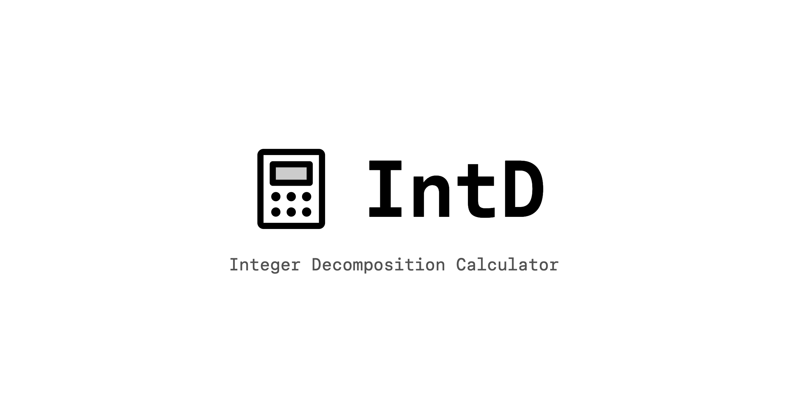

<div align="center">

# IntD — Integer Decomposition Calculator



An algorithm demo about Constrained **Int**eger **D**ecomposition Problem.

Live at [https://intd.pages.dev](https://intd.pages.dev).


</div>

## Project Structure

```
src/
├── components/       # UI components (pages/, layout/, ui/)
├── content/          # Per-locale MDX content (zh_tw/, en/)
├── hooks/            # Custom hooks
├── lib/              # Pure logic (decompose, schema, format, …)
├── locales/          # i18n strings (zh.json, en.json)
└── routes/           # File-based routes (TanStack Router)
```

## i18n Routing

Chinese is the bare path (`/`, `/algo`, `/about`); English is prefixed with `/en`.
The URL is the single source of truth for language — `use-lang.ts` derives it from
the path, and `LangSync` in `__root.tsx` keeps i18next and `document.lang` in sync.

UI strings live in `src/locales/{zh,en}.json`; long-form content lives as per-locale
MDX under `src/content/{zh_tw,en}/`.

## Development

Requires Node.js 22+ and pnpm.

```bash
pnpm install  # install dependencies
pnpm dev      # start dev server at localhost:3000
pnpm build    # production build
pnpm check    # format + lint + type-check
```

## Algorithm Note

See [https://intd.pages.dev/algo](https://intd.pages.dev/algo)

## Contributing

Contributions are welcome! Feel free to open an issue or submit a pull request.

- **Bug reports** — please include steps to reproduce and the expected behavior.
- **New features** — open an issue first to discuss before sending a PR.
- **i18n** — UI strings are in `src/locales/{zh,en}.json`; keep both files in key parity.
- **Code style** — run `pnpm check` before submitting; the project uses Biome for linting and formatting.

## License

MIT - See [LICENSE](https://github.com/rutopio/intd/blob/master/LICENSE)